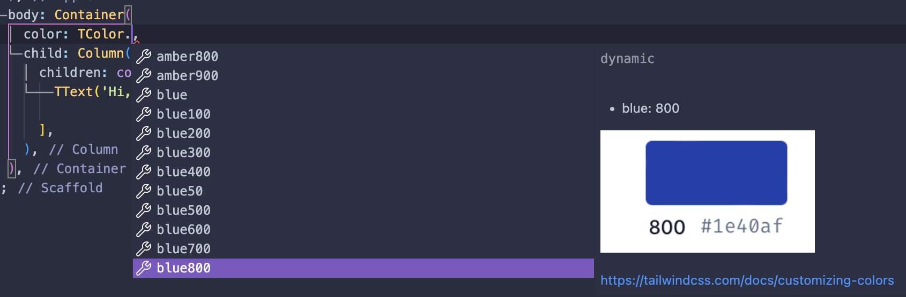

# tailwind_standards
A styling package based on Tailwind standards. It uses the default colors, sizes and weight. On top of that it has the ```TText``` widget that takes classes the same way how you use tailwind in HTML.

## Features
- TColor: use all tailwind default colors
- TSize: all tailwind default sizes easily accessable
- TWeight: use the naming convention of tailwind for weights
- TText: A extension on the Flutter Text widget that can be styled in the same way as a class in HTML.

## Getting started

To install the package run the following command.
```
flutter pub add tailwind_standards
```

## Usage

### TColor
TColor has all the default colors that tailwind offers. You can access every color in the following way.
``` 
Color tcolor = TColor.slate500;
```


### TSize
TSize has all the default Tailwind sizes that are mostly used in padding, margin, etc.
```
int tsize = TSize.lg;
```

### TWeight
TWeight translates the the tailwind naming convention to font weights to Flutter's ```FontWeight```
```
FontWeight tweight = TWeight.semibold;
```

### TText
TText is an extension of the ```Text``` widget from Flutter. It takes classes in the same structure as when you use Tailwind for HTML.
```
const TText(
    'TText widget from tailwind_standards!',
    props: 'text-xs text-gray-500 text-center font-bold',
),
```
## Additional information

Feedback is always welcome! If you see improvements or something comes to your attention, please let me know!
